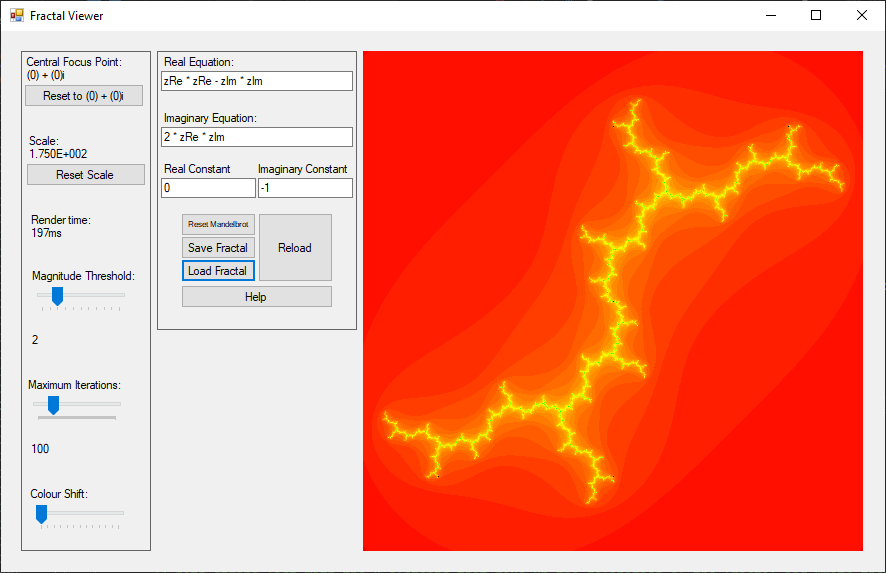
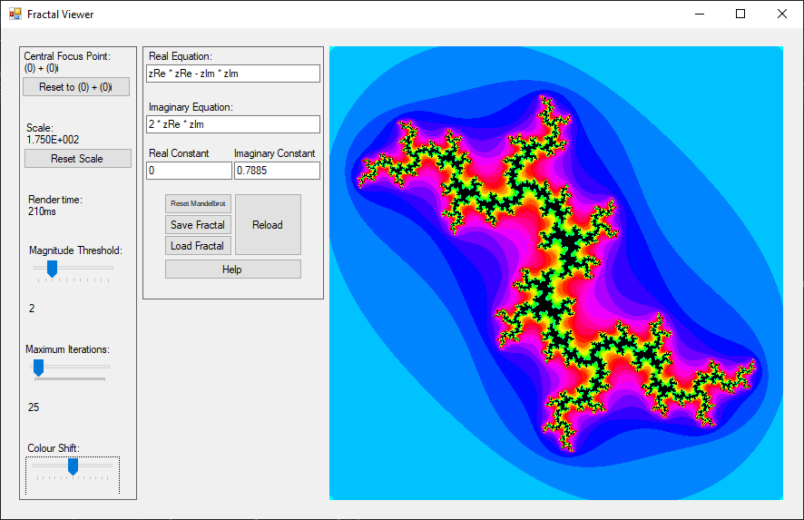

About:
======
### What are Fractals?
Fractals are fascinating mathematical structures that exhibit self-similarity at various scales. They are created through the repetition of simple geometric shapes, producing intricate and complex patterns that are both beautiful and infinitely detailed.

### The Power of Exploration
My Fractal Generator and Visualizer empowers you to explore the depths of fractal artistry. Whether you're a seasoned mathematician or an art enthusiast, this tool provides a dynamic and interactive platform for discovering the mesmerizing beauty hidden within mathematical equations.

|                                     |                                   |
|-------------------------------------|-----------------------------------|
|  |      |
|   |  |

Help:
=====

To get the detail of what a button/ slider/ textbox does, focus on it and press the f1 key.

### Reset To Origin

This resets the visualiser to have it's central point be at 0+0i (or (0,0)).

### Reset Scale

This resets the visualiser to have it's scale to 175x, which is roughly the area from (-1.4-1.4i) to (1.4+1.4i) when the size of the picture is 500px x 500px.

### Render Time

This is a measure of how long it took for your computer to generate the image of the fractal based on the parameters selected. Measured in milliseconds.

### Magnitude Threshold

This controls what value of z is considered to be divergant. For example, if this value is 2, then that means for a value to be defined as diverging (growing to infinity), the absolute value of z must be greater than 2. This definies which pixels are classed as divergent (coloured in).

### Maximum Iterations

This changes how many iterations of the formula defined are applied to any pixel. If the value has not diverged (become greater than the magnitude threshold) by the time maximum iterations has been reached, the pixel is classed as convergent (not coloured in, approaches a single value). Higher values results in higher levels of detail.

### Colour Shift

This allows the user to change the base colour of the fractal.

### Variables For Equations

| Variable | Explanation                                                             |
|----------|-------------------------------------------------------------------------|
| zRe      | Real component of the current iterated complex number.                  |
| zIm      | Imaginary component of the current iterated complex number.             |
| cRe      | Constant real component of the initial complex number (the pixel).      |
| cIm      | Constant imaginary component of the initial complex number (the pixel). |

### Real Equation

Enter a formula that will be applied to the real part of the complex number in each iteration per pixel. You can use the variables as defined above.

### Imaginary Equation

Enter a formula that will be applied to the imaginary part of the complex number in each iteration per pixel. You can use the variables as defined above.

### Real Constant

A numerical constant c added to the real part every iteration.

### Imaginary Constant

A numerical constant c added to the imaginary part every iteration.

### Reset Mandelbrot

Resets the equation to show the mandelbrot set.

### Save Fractal

Allows you to save your currently entered fractal as a .fra file.

### Load Fractal

Loads a given fractal from a .fra file saved earlier.

### Reload Fractal

Reload the fractal based on the current entered equations.